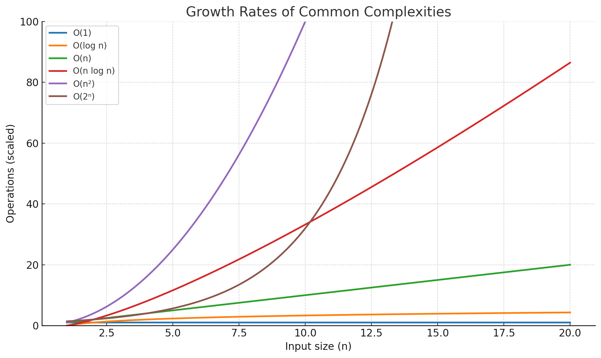

# Asymptotic Notations

## **What is Asymptotic Notation?**

Imagine you’re trying to see **how fast an algorithm is** as your input size grows.
You don’t care about small details like:

* The brand of your CPU
* Whether you used `i++` or `i += 1`
* Exact number of milliseconds

Instead, you want to know:
💡 **“What happens when my input gets HUGE?”**

That’s where **asymptotic notation** comes in. It’s like **short-hand math** for describing *growth rates* of algorithms.

---

## **Why do we need it?**

1. **Ignore constants and small terms** — focus on the big picture.
2. **Compare algorithms fairly** — across different machines.
3. **Predict scalability** — how well will it handle massive input.

Example:

* Algorithm A takes `0.05n² + 2n + 3` operations.
* Algorithm B takes `100n + 10` operations.

For small `n`, B might be slower due to the big constant `100`.
But as `n` grows, `n²` will crush `n`, so **A will eventually be much slower**.

---

## **The Main Asymptotic Notations**

There are **five primary notations** you’ll see often.

---

### **Big O — Upper Bound**

**Definition:** Describes the **worst-case growth rate**.
It tells you: “It won’t grow faster than this.”

**Formal idea:**

```bash
f(n) = O(g(n))  means  f(n) ≤ C × g(n)   for some constant C, for large enough n.
```

**Example:**
If an algorithm takes `3n + 2` steps, then it’s **O(n)**.
It won’t ever grow faster than some multiple of `n`.

**You use Big O for:**

* Worst-case runtime (common in competitive programming).
* Space complexity upper bound.

---

### **Big Omega (Ω) — Lower Bound**

**Definition:** Describes the **best-case growth rate**.
It says: “It will take at least this much time.”

**Formal idea:**

```bash
f(n) = Ω(g(n))  means  f(n) ≥ C × g(n)   for some constant C, for large enough n.
```

**Example:**
If you must check every element at least once, best case is **Ω(n)**.

---

### **Big Theta (Θ) — Tight Bound**

**Definition:** Describes an **exact growth rate**.
It says: “It grows at this rate, no faster, no slower (asymptotically).”

**Formal idea:**

```bash
f(n) = Θ(g(n))  means  it’s both O(g(n)) and Ω(g(n)).
```

**Example:**
`5n + 3` is Θ(n) because:

* Upper bound is O(n)
* Lower bound is Ω(n)

**Think:** Θ is like **pinning it down exactly**.

---

### **Little o — Strictly Less Than**

**Definition:** Describes that a function grows **strictly slower** than another.

**Formal idea:**

```bash
f(n) = o(g(n))  means  f(n) grows slower than g(n), and ratio → 0 as n → ∞.
```

**Example:**
`n` is `o(n²)` because as n grows, `n / n² = 1/n → 0`.

---

### **Little omega — Strictly Greater Than**

**Definition:** Opposite of little o.
Function grows **strictly faster**.

**Formal idea:**

```bash
f(n) = ω(g(n))  means  f(n) grows faster than g(n), and ratio → ∞ as n → ∞.
```

**Example:**
`n²` is `ω(n)` because `n² / n = n → ∞`.

---



---

## **Order of Growth Cheat Sheet**

From slowest to fastest (common ones):

| Growth Rate    | Name          | Example                        |
| -------------- | ------------- | ------------------------------ |
| **O(1)**       | Constant time | Access array element           |
| **O(log n)**   | Logarithmic   | Binary search                  |
| **O(n)**       | Linear        | Loop through array             |
| **O(n log n)** | Log-linear    | Merge sort                     |
| **O(n²)**      | Quadratic     | Nested loops                   |
| **O(n³)**      | Cubic         | Triple nested loops            |
| **O(2ⁿ)**      | Exponential   | Naive recursive Fibonacci      |
| **O(n!)**      | Factorial     | Traveling salesman brute-force |

---

## **Dropping Constants & Lower-Order Terms**

When writing Big O, we **only care about the dominant term** as `n → ∞`.

Example:
`T(n) = 3n² + 10n + 5` → **O(n²)**
Because:

* `n²` dominates for large `n`
* Constants (3, 10, 5) don’t matter.

---

## **Best, Worst, and Average Cases**

* **Best case** → Often given in Ω notation.
* **Worst case** → Often given in O notation.
* **Average case** → Can also use Θ notation.

Example:
Linear search in an array of size `n`:

* Best case (element at start) → Ω(1)
* Worst case (element at end or absent) → O(n)
* Average case → Θ(n)

---

## **Graphical Intuition**

If we plotted time vs input size:

* **O(n)** → straight upward slope
* **O(log n)** → rises quickly at first, then flattens
* **O(n²)** → curve gets steep fast
* **O(2ⁿ)** → skyrockets almost immediately

---

## **Quick Summary Table**

| Notation    | Meaning       | Says What?                | Example |
| ----------- | ------------- | ------------------------- | ------- |
| **O(g(n))** | Upper bound   | Worst-case                | O(n²)   |
| **Ω(g(n))** | Lower bound   | Best-case                 | Ω(n)    |
| **Θ(g(n))** | Tight bound   | Exact asymptotic behavior | Θ(n)    |
| **o(g(n))** | Strictly less | Grows slower              | o(n²)   |
| **ω(g(n))** | Strictly more | Grows faster              | ω(n)    |
