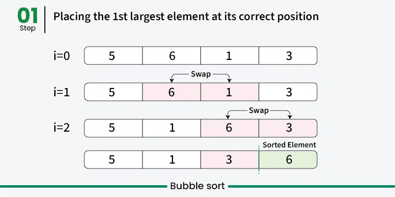
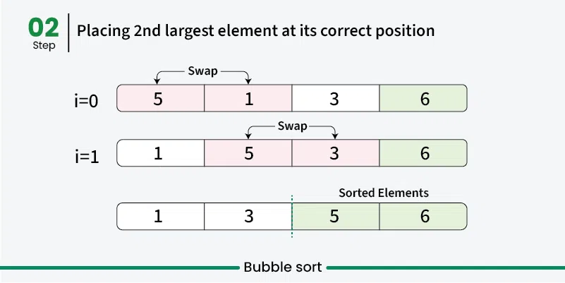
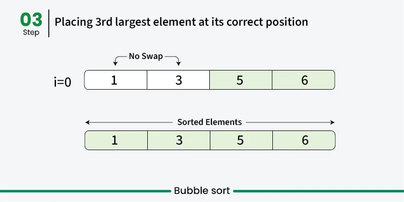

# Bubble Sort

Bubble Sort is the simplest sorting algorithm that works by repeatedly swapping the adjacent elements if they are in the wrong order. This algorithm is not suitable for large data sets as its average and worst-case time complexity are quite high.

We sort the array using multiple passes. After the first pass, the maximum element goes to end (its correct position). Same way, after second pass, the second largest element goes to second last position and so on.

In every pass, we process only those elements that have already not moved to correct position. After k passes, the largest k elements must have been moved to the last k positions.

In a pass, we consider remaining elements and compare all adjacent and swap if larger element is before a smaller element. If we keep doing this, we get the largest (among the remaining elements) at its correct position.

## Visualization

## Time Complexity

| Case        | Time Complexity |
|-------------|----------------|
| Best Case   | O(n)           |
| Average Case| O(n^2)           |
| Worst Case  | O(n^2)           |

Where *n* is the number of elements in the array.

## Space Complexity

| Case        | Space Complexity |
|-------------|-----------------|
| All Cases   | O(1)            |
