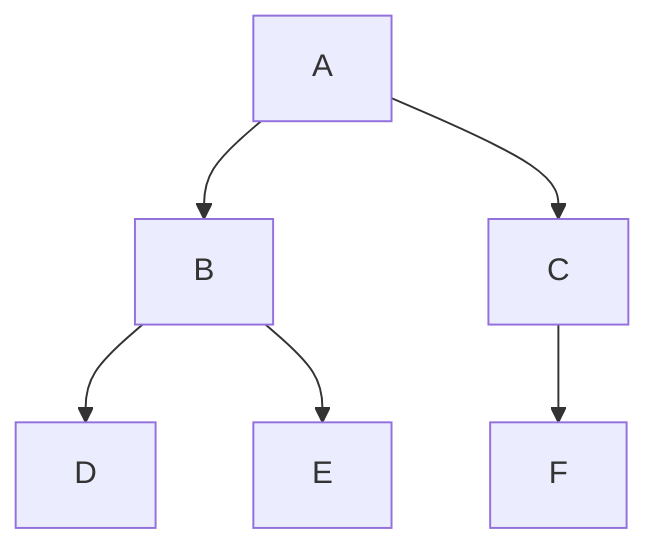
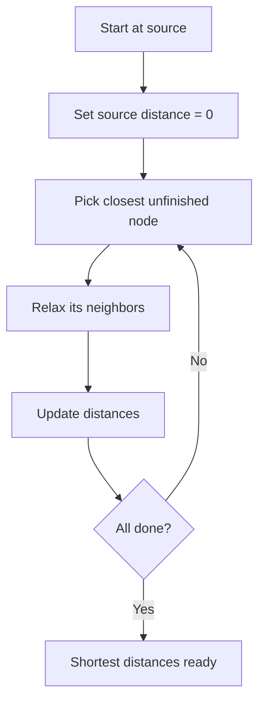
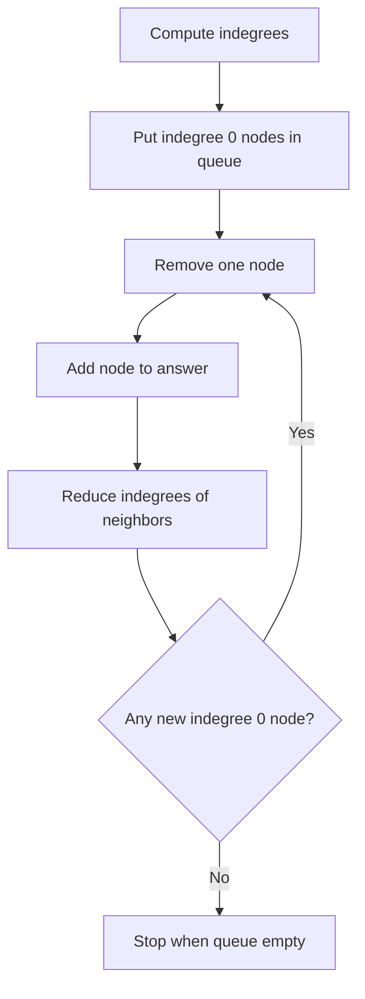
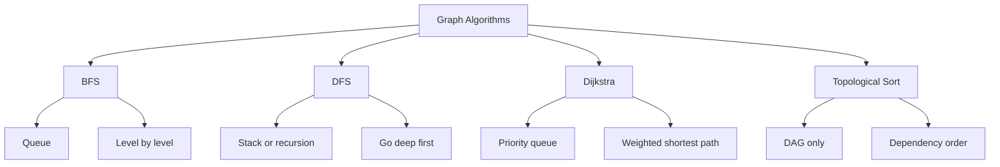

# Visual Comparison Of Graph Algorithms

This file uses Mermaid diagrams to explain graph traversal and search visually.

## Sample Graph

## BFS

## DFS

## Dijkstra

## Topological Sort

## One-Page Comparison

