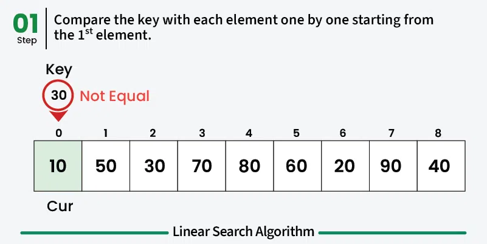
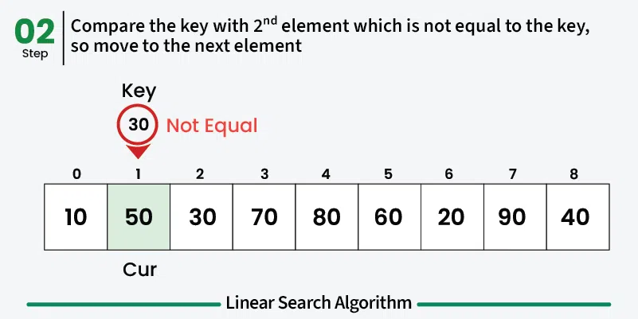
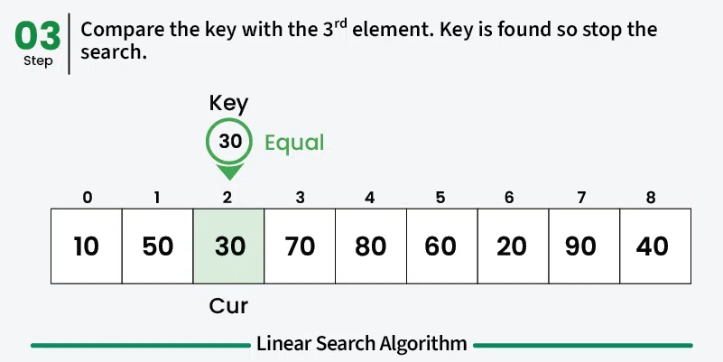

# Linear Search

In Linear Search, we iterate over all the elements of the array and check if it the current element is equal to the target element.
If we find any element to be equal to the target element, then return the index of the current element.
Otherwise, if no element is equal to the target element, then return -1 as the element is not found. Linear search is also known as sequential search.

## Visualization

## Time Complexity

| Case        | Time Complexity |
|-------------|----------------|
| Best Case   | O(1)           |
| Average Case| O(n)           |
| Worst Case  | O(n)           |

Where *n* is the number of elements in the array.

## Space Complexity

| Case        | Space Complexity |
|-------------|-----------------|
| All Cases   | O(1)            |

Linear search uses a constant amount of extra space regardless of the input size.
