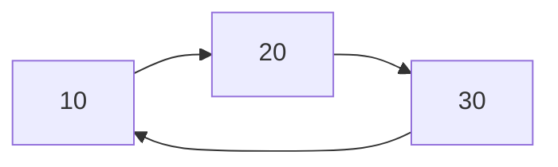
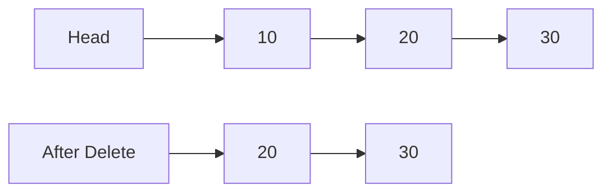
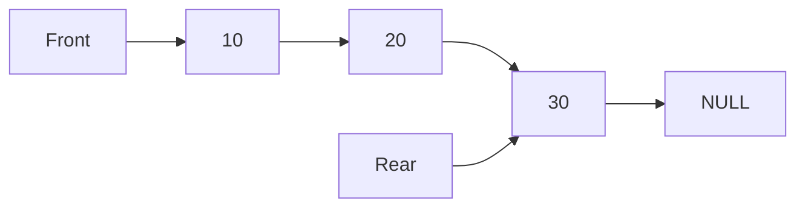
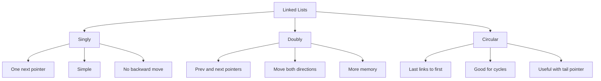

# Visual Comparison Of Linked Lists

This file uses Mermaid diagrams to compare linked list structures and operations.

## Singly Linked List

Each node only knows the next node.

## Doubly Linked List

Each node knows both previous and next.

## Circular Linked List

The last node points back to the first node.

## Insert At Front In Singly Linked List

Only a few pointer changes are needed, so it is `O(1)`.

## Delete Front In Singly Linked List

## Linked Stack

Push and pop happen at the top, so both are `O(1)`.

## Linked Queue

Enqueue at rear and dequeue at front are both `O(1)` when front and rear are stored.

## One-Page Comparison

