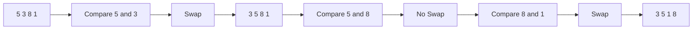
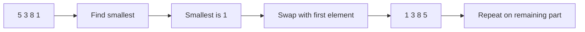
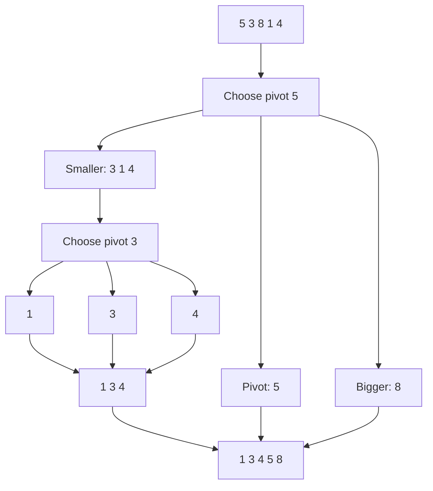
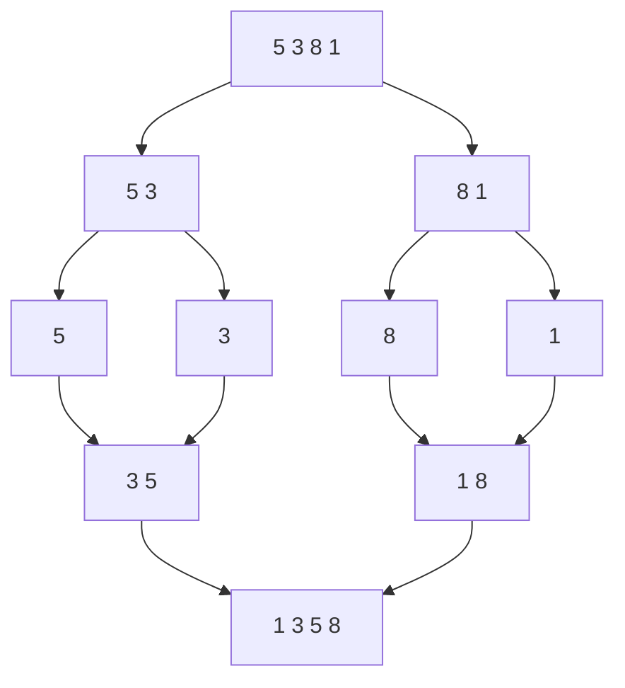
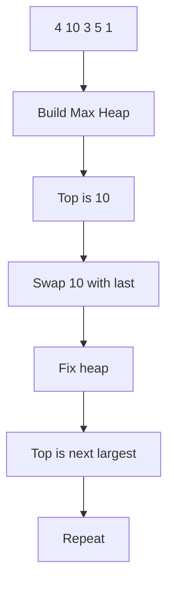
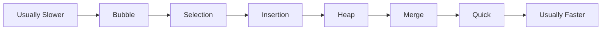

# Visual Comparison Of Sorting Algorithms

This file uses **Mermaid diagrams** to show how different sorting algorithms work.

If your Markdown viewer supports Mermaid, these diagrams will render as flowcharts.

## Bubble Sort

Idea: compare neighbors and swap if they are in the wrong order.



## Insertion Sort

Idea: take one new item and insert it into the correct place in the sorted part.

```mermaid
flowchart LR
    A[Sorted: 5 | Unsorted: 3 8 1] --> B[Take 3]
    B --> C[Insert before 5]
    C --> D[Sorted: 3 5 | Unsorted: 8 1]
    D --> E[Take 8]
    E --> F[Insert after 5]
    F --> G[Sorted: 3 5 8 | Unsorted: 1]
```

## Selection Sort

Idea: find the smallest item and place it in front.



## Quick Sort

Idea: choose a pivot, split into smaller and bigger parts, then sort both sides.



## Merge Sort

Idea: split into halves, sort each half, then merge them back together.



## Heap Sort

Idea: build a max-heap, remove the largest item, and repeat.



## One-Page Comparison

```mermaid
flowchart TD
    A[Sorting Algorithms] --> B[Bubble Sort]
    A --> C[Insertion Sort]
    A --> D[Selection Sort]
    A --> E[Quick Sort]
    A --> F[Merge Sort]
    A --> G[Heap Sort]

    B --> B1[Swap neighbors]
    B --> B2[Usually O(n^2)]

    C --> C1[Insert into sorted part]
    C --> C2[Good for small or nearly sorted data]

    D --> D1[Pick smallest each round]
    D --> D2[Always O(n^2)]

    E --> E1[Split around pivot]
    E --> E2[Average O(n log n)]
    E --> E3[Worst O(n^2)]

    F --> F1[Split and merge]
    F --> F2[Always O(n log n)]
    F --> F3[Needs extra memory]

    G --> G1[Use max-heap]
    G --> G2[Always O(n log n)]
    G --> G3[In-place]
```

## Speed Ladder



Note: this is a simple learning picture, not a perfect rule for every case.
