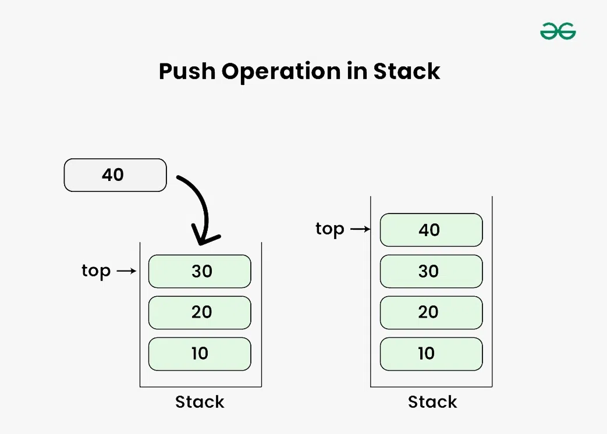
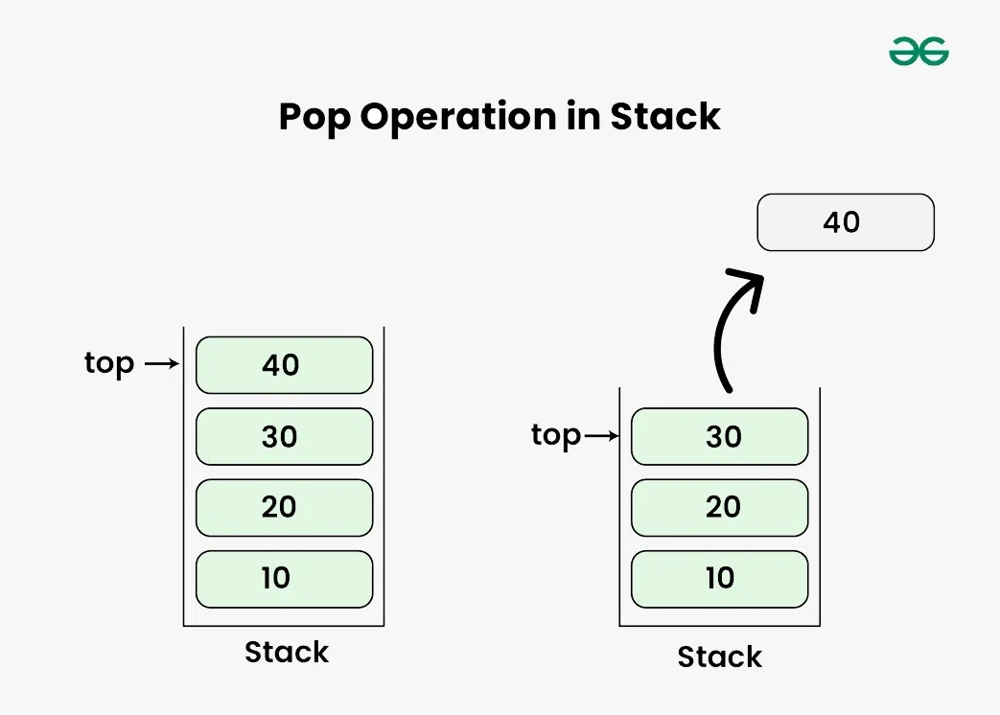

# Stack

Stack is the linear data structure that follows the Last in, First Out(LIFO) principle of data insertion and deletion.
It means that the element that is inserted last will be the first one to be removed and the element that is inserted first will be removed at last. Think of it as the stack of plates stacked on top of one another where we can only add or remove the top plate.

### Stack Is Fist In First Out ( LIFO )

## Visualization

## Operations

- **Is Full**: Check if the stack is full.
- **Is Empty**: Check if the stack is empty.
- **Pop**: Remove the top element from the stack.
- **Push**: Add an element to the top of the stack.
- **Display**: Display all the elements in the stack.
- **Peek**: Get the top element of the stack without removing it.

## Time Complexity

| Operation | Time Complexity |
|-----------|----------------|
| Is Full   | O(1)           |
| Is Empty  | O(1)           |
| Pop       | O(1)           |
| Push      | O(1)           |
| Display   | O(n)           |
| Peek      | O(1)           |

Where *n* is the number of elements in the stack.
