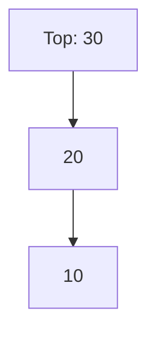
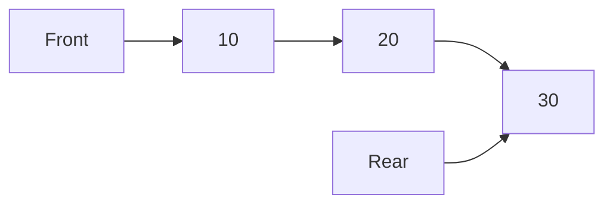
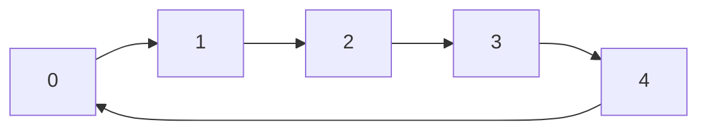
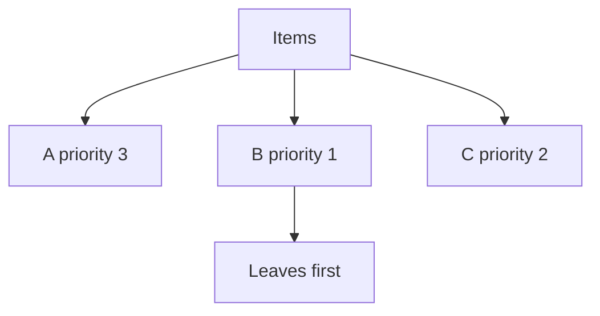
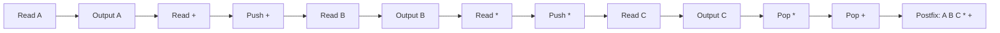
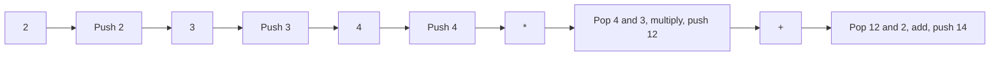
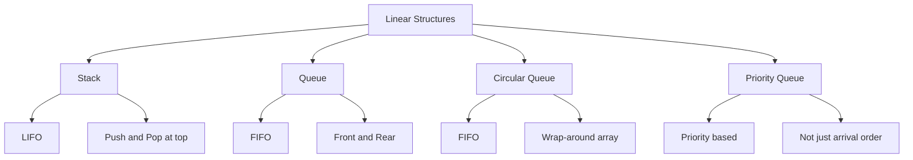

# Visual Comparison Of Stacks And Queues

This file uses Mermaid diagrams to explain stacks and queues visually.

## Stack

`push` and `pop` happen at the top.

## Queue

Insertion happens at rear. Deletion happens at front.

## Circular Queue

Rear wraps around to reuse free space.

## Priority Queue

The highest-priority item is served first.

## Infix To Postfix Using Stack

## Postfix Evaluation

## One-Page Comparison

