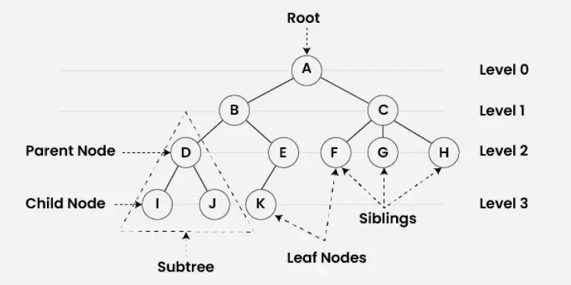

# Trees

Tree Data Structure is a non-linear data structure in which a collection of elements known as nodes are connected to each other via edges such that there exists exactly one path between any two nodes.

## Binary Tree

A Binary Tree Data Structure is a hierarchical data structure in which each node has at most two children, referred to as the left child and the right child. It is commonly used in computer science for efficient storage and retrieval of data, with various operations such as insertion, deletion, and traversal.

Here’s your **binary tree notes** rewritten to be more descriptive, structured, and easy to read while keeping the technical depth intact:

---

## **Binary Tree Properties & Notes**

> **Note:** In this convention, the **height** of the root node is considered **0**.
> An **empty tree** (root = `NULL`) is considered to have height **-1**.

---

### **1. Maximum Nodes at a Given Level `l`**

* A binary tree can have **at most** $2^l$ nodes at level **l**.
* **Level Definition:** The number of **edges** in the path from the root to a node.

  * Root is at **level 0**.
  * Children of the root are at **level 1**, and so on.

**Proof (by induction):**

1. **Base Case:** Level $l = 0$ → $2^0 = 1$ node (only the root).
2. **Inductive Step:**
   If level `l` has $2^l$ nodes, then each node can have **up to 2 children**, making the next level:

   $$
   2 \times 2^l = 2^{l+1}
   $$

---

### **2. Maximum Nodes in a Binary Tree of Height `h`**

* A binary tree of height `h` can have **at most**:

$$
\text{Max Nodes} = 2^{h+1} - 1
$$

**Height Definition:**

* Height is the **number of edges in the longest path** from the root to a leaf.
* A tree with **one root node only** has height `0`.
* An **empty tree** has height `-1`.

**Derivation:**
When all levels are completely filled:

$$
1 + 2 + 4 + \dots + 2^h = 2^{h+1} - 1
$$

**Alternate Height Convention:**
Some books define height differently:

* Tree with **one root node** → height = 1
* Empty tree → height = 0
  Then, the formula becomes:

$$
\text{Max Nodes} = 2^h - 1
$$

---

### **3. Minimum Height for `N` Nodes**

* The **minimum possible height** for `N` nodes:

$$
h_{\min} = \lfloor \log_2 N \rfloor
$$

**Explanation:**
From the max nodes formula:

$$
N \le 2^{h+1} - 1
$$

Rearranging:

$$
h \ge \log_2(N + 1) - 1
$$

Taking the floor gives:

$$
h_{\min} = \lfloor \log_2 N \rfloor
$$

---

### **4. Minimum Levels for `L` Leaves**

* A binary tree with `L` leaves must have **at least**:

$$
l_{\min} = \lfloor \log_2 L \rfloor
$$

**Reason:**

* Max leaves occur when the last level is completely filled.
* From Property 1:

$$
L \le 2^l
$$

Solving for `l`:

$$
l_{\min} = \lfloor \log_2 L \rfloor
$$

---

### **5. Relation Between Nodes with Two Children and Leaf Nodes**

In a **full binary tree** (every node has 0 or 2 children):

$$
L = T + 1
$$

Where:

* `L` = number of leaf nodes
* `T` = number of nodes with two children

**Proof:**

* Full binary tree with height `h` has:

  $$
  \text{Total Nodes} = 2^{h+1} - 1
  $$
* Leaves at the last level:

  $$
  L = 2^h
  $$
* Internal nodes:

  $$
  T = (2^{h+1} - 1) - 2^h = 2^h - 1
  $$

Thus:

$$
L = T + 1
$$

---

### **6. Total Edges in a Binary Tree**

* Any **non-empty binary tree** with `n` nodes has exactly:

$$
\text{Edges} = n - 1
$$

**Reason:**

* Every node (except the root) has exactly one parent → one incoming edge.
* Therefore, `n - 1` edges connect `n` nodes.

---

#### **Node Types**

* **Leaf Node:** 0 children
* **Unary Node:** 1 child
* **Binary Node:** 2 children

#### **Common Binary Tree Types**

* **Full Binary Tree:** Every non-leaf node has exactly two children.
* **Complete Binary Tree:** All levels filled except possibly the last, which is filled from **left to right**.
* **Perfect Binary Tree:** All levels completely filled; all leaves at the same depth.
* **Balanced Binary Tree:** Height difference between left and right subtrees ≤ 1 for every node.
