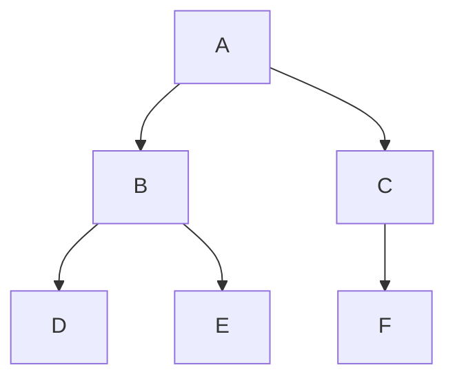
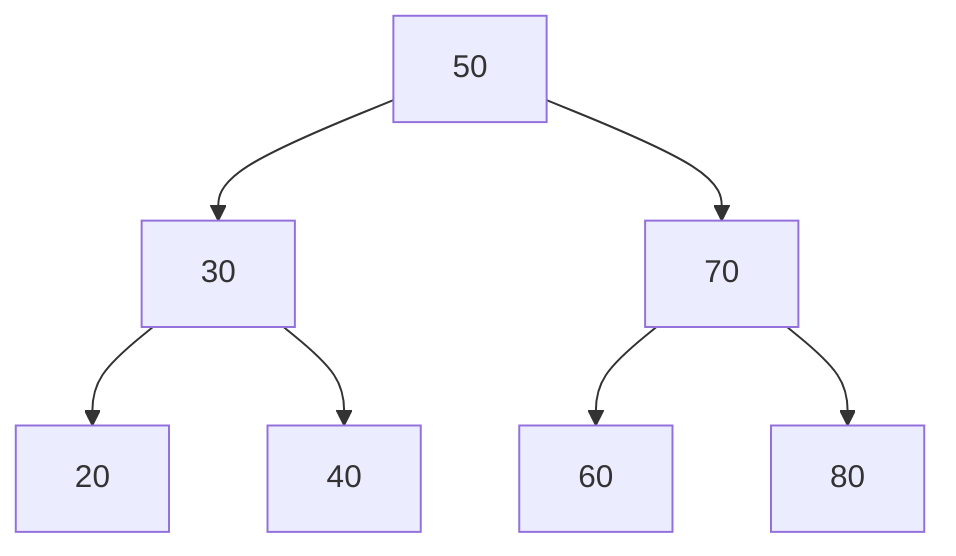
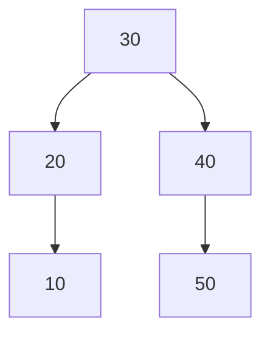
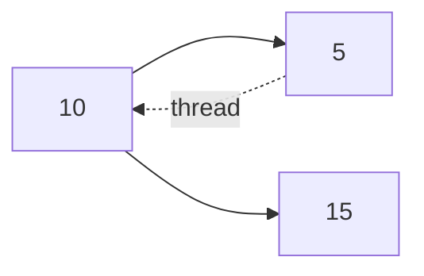
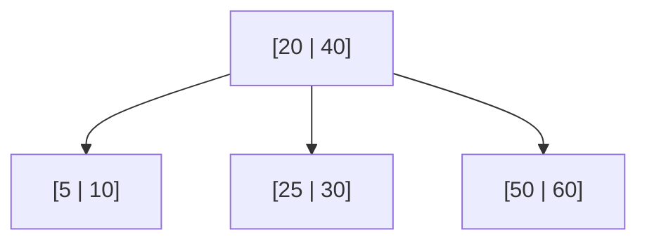
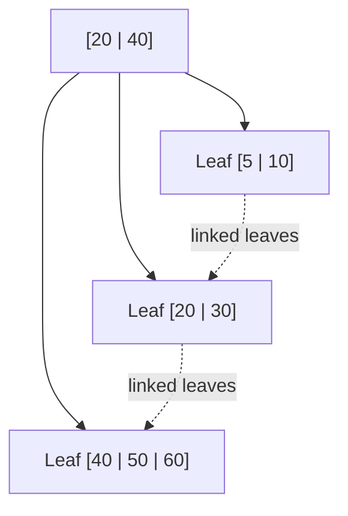
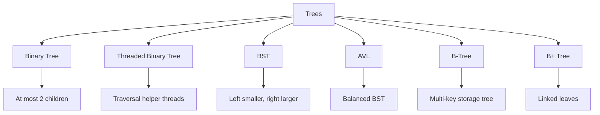

# Visual Comparison Of Trees

This file uses Mermaid diagrams to explain tree structures visually.

## Binary Tree

## BST

Left side is smaller. Right side is larger.

## AVL Tree

The tree keeps itself balanced using rotations.

## Threaded Binary Tree

The dotted thread shows a special pointer used for traversal.

## B-Tree

One node can store multiple keys.

## B+ Tree

Leaves are linked for fast ordered scanning.

## One-Page Comparison

